# 👨‍💻 Samuel Jorge Covalski

🚀 **Desenvolvedor de Software em formação | ADS**  
Sou estudante de **Análise e Desenvolvimento de Sistemas**, construindo minha trajetória na área de tecnologia e desenvolvimento de software. Tenho interesse em entender como os sistemas funcionam e gosto de transformar problemas em soluções através da programação.  

Atualmente estou aprofundando meus conhecimentos em **Java, SQL, desenvolvimento web, Git/GitHub, Linux e Microsoft Azure**, sempre buscando transformar o aprendizado em projetos práticos.

---

## 🛠️ Tecnologias e Ferramentas

### 💻 Desenvolvimento
 
 

### 🗄️ Banco de Dados
 

### 🔧 Ferramentas
 
 
 

---

## 📚 Atualmente estudando
- ☕ Java  
- 🗄️ SQL e MySQL  
- 🌐 HTML e CSS  
- 💻 Lógica de programação  
- 🧩 Programação Orientada a Objetos  
- 🔧 Git e GitHub  
- 🐧 Linux  
- ☁️ Microsoft Azure  
- 🖥️ Desenvolvimento de sistemas  

---

## 🚀 Projetos em destaque

### 💈 Soberano Barbearia
Projeto desenvolvido para praticar desenvolvimento web, organização de projeto e banco de dados.  
**Principais recursos:**  
🌐 Interface web | 💈 Serviços e preços | 📅 Agendamento | 🕐 Horários | 📍 Localização | 📱 WhatsApp | 🗄️ Banco de dados | 📚 Documentação  
🔗 [Ver projeto](https://github.com/Sajoco-afk/Soberano-Barbearia)

---

### 🗄️ Mynetflox

Modelagem de banco de dados inspirada em uma plataforma de streaming.  
**Práticas:** Modelagem de dados | Relacionamentos | SQL | Organização de informações  
🔗 [Ver projeto](https://github.com/Sajoco-afk/Mynetflox)

---

### ☁️ Servidor Virtual Azure

Exploração de conceitos relacionados à criação e configuração de máquinas virtuais e serviços em nuvem.  
🔗 [Ver projeto](https://github.com/Sajoco-afk/Servidor-virtual-Azure)

---

### ☕ Hora do Sistema

Projeto introdutório em **Java**, utilizando a classe `Date` para exibir data e hora do sistema.  
Inclui uso de **Maven** e **NetBeans**.  
🔗 [Ver projeto](https://github.com/Sajoco-afk/HoraDoSistema)

---

## 🎓 Formação

### 📚 Análise e Desenvolvimento de Sistemas
Atualmente construindo minha formação na área de desenvolvimento de software.

### 💻 Estudos complementares
- SENAI  
- SENAC  
- DIO  
- Microsoft Azure  

---

## 📊 Estatísticas do GitHub

 
   
   

---

## 🎯 Objetivo
Meu objetivo é continuar evoluindo como profissional de tecnologia, desenvolver projetos cada vez mais completos e conquistar uma oportunidade na área de **desenvolvimento de software**.  
Busco transformar conhecimento em prática, construir um portfólio consistente e evoluir continuamente como desenvolvedor.

---

## 📫 Vamos nos conectar?
  

---

⭐ *Aprendendo, desenvolvendo e evoluindo todos os dias.*
